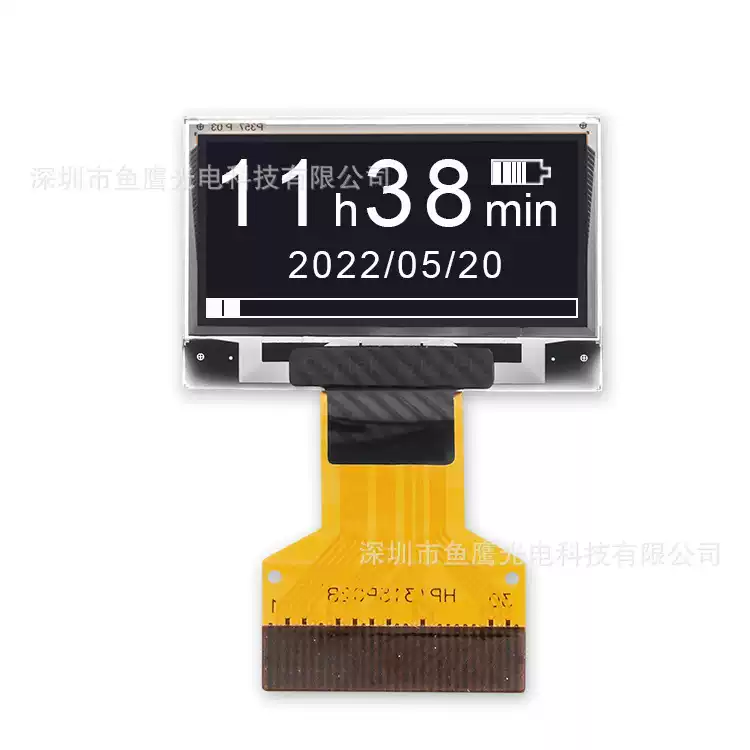

<p align="left"></p>

<h1 align="center">OSPTEK 0.96″ OLED 128×64 (SSD1315 · SPI / I2C)</h1>

<p align="center"><b>Monochrome OLED · SPI / I2C · SSD1315</b></p>

<p align="center"><a href="./README.md">简体中文</a> | English · <a href="../../README_EN.md">Family index</a></p>

<p align="center">
  
  
  
  
</p>

<p align="center"></p>

## Contents

- [Overview](#overview)
- [Specifications](#specifications)
- [Sample projects](#sample-projects)
- [Repository layout](#repository-layout)
- [Resources](#resources)
- [Buy](#buy)
- [Support](#support)

---

## Overview

OSPTEK **0.96″ 128×64 OLED** is a **SPI / I2C** white monochrome display module driven by **SSD1315**. Suited to status bars, menu prompts, and small debug displays.

Spec ID (repository name): `oled-0.96-128x64-spi_i2c-ssd1315`

Current module version: **OED096-12864W009-C30**. Electrical and mechanical details follow [`docs/OED096-12864W009-C30.pdf`](./docs/OED096-12864W009-C30.pdf).

## Specifications

| Item | Spec |
| ---- | ---- |
| Size | 0.96 inch |
| Type | OLED (monochrome, white) |
| Resolution | 128×64 |
| Interface | SPI / I2C |
| Driver IC | SSD1315 |

> Full outline, FPC definition, power, and timing follow the product datasheet / driver IC datasheet.

## Sample projects

| Description | Path |
| ---- | ---- |
| ESP32-S3 · SSD1315 I2C bringup (face animation demo) | [`examples/esp32s3-oled-0.96-128x64-i2c-ssd1315-bringup/`](./examples/esp32s3-oled-0.96-128x64-i2c-ssd1315-bringup/) |

## Repository layout

```text
oled-0.96-128x64-spi_i2c-ssd1315/         # repo root (nav: ../../README_EN.md)
└── versions/
    └── OED096-12864W009-C30/             # full materials for this part number
        ├── README.md
        ├── README_EN.md
        ├── images/
        ├── docs/
        └── examples/
```

## Resources

### Product files

| Resource | Link |
| ---- | ---- |
| Product datasheet (OED096-12864W009-C30) | [`docs/OED096-12864W009-C30.pdf`](./docs/OED096-12864W009-C30.pdf) |
| Driver IC datasheet (SSD1315) | [`docs/SSD1315.pdf`](./docs/SSD1315.pdf) |
| SSD1315 SPI init code | [`docs/ssd1315-spi-init.c`](./docs/ssd1315-spi-init.c) |

### Sample projects

- [ESP32-S3 SSD1315 I2C bringup](./examples/esp32s3-oled-0.96-128x64-i2c-ssd1315-bringup/)

## Buy

<p align="center">
  <a href="https://www.aliexpress.com/store/1105701619"></a>
  &nbsp;&nbsp;
  <a href="https://shop110742373.taobao.com/"></a>
</p>

**Overseas (AliExpress)**

- Store: [OSPTEK Official Store](https://www.aliexpress.com/store/1105701619)

**China (Taobao)**

- Store: [鱼鹰光电工厂店](https://shop110742373.taobao.com/)

## Support

- Technical support / product inquiry: <luyu@osptek.com>
- QQ group: **985881096**
- Website: <https://osptek.com/>
- Feel free to open an Issue in this repository with any questions

---

<p align="center"><sub>© 2026 OSPTEK · Materials in this repository are licensed under CC BY 4.0</sub></p>
